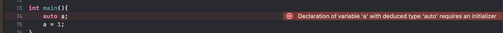
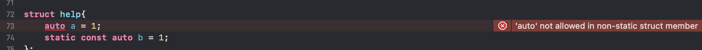
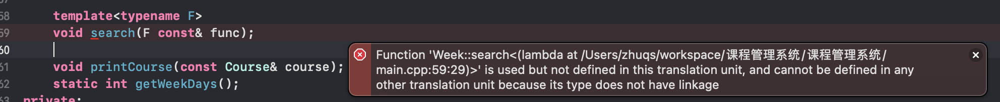

## 由`function`参数引出的一些问题
`lambda`最常见用于一些回调或者注册函数,例如algorithm里的一些函数需要传入函数作为参数,如`std::sort`、`std::find_if`等等
今天想写一个类似的需要用户自己传入的查询方法的查询函数(类似`std::find_if`),一开始的想法是这样
```
    search(std::funtion<bool(type1&,...)> &func);
```
但是参数的类型不确定,想使用auto来代替但是编译器报错,这里就去回顾了下`auto`的用法
### `auto`
简单的来说 `auto`的加入使得`c++`有动态语言的味了 对于一个变量不必要声明它的类型,例如在`c++`中声明一个整形变量必须要用如下的格式
```
    int a = 1;
    或者
    int a;
    a = 1;
```
而在`python`等动态语言中,$\color{#f}只需要如下的写法
```
    a = 1
```
就自然可以推导出`a`的类型为整型,而`auto`的引入使`c++`具备了类似的功能,具体使用方法如下
```
    auto a = 1; //会推导出a为整型

    A a;
    auto b = a; //会推导b为Class A类型
```
看起来好像没什么用处的样子? 但是在一些复杂的情况下就很爽了,例如常见的声明迭代器,其中`list`的类型为`std::list<std::vector<int>>`,那么对应的写法就是:
```
    std::list<std::vector<int>>::iterator iter = list.begin();

```
类似的还有`function`的声明(好像回到了正题),其中`function`要绑定一个`bool help(type1&,type2&)`类型的函数，那么对应的写法就是:
```
    std::function<bool(type1&,type2&)> func = std::bind(help);
```
这种写法简直不要太麻烦 如果每一次用到iter或者func的时候都要这样声明一遍来写这么一长串类型 想着都很难受

但是如果用`auto`呢就不要太方便,上面对应的写法可以变成
```
    auto iter = list.begin();
    auto func = std::bind(help);
```

虽然`auto`看起来很好用,但是也存在着一些问题,就是必须要让编译器能够推导出对应变量的类型,否则会报错,下面举个例子
```
    auto a;
```
这个时候`a`变量的类型就无法推导 其实说白了`auto`就是一个占位符 编译器在编译的时候根据上下文来对`auto`进行替换 当编译器不能**推导出auto的类型时,`auto`就无法使用** 最常见的问题就是在声明`auto`变量时没有进行初始化,就是上面的问题,编译器会出现类似的提示


类似的`auto`会出错的情况有  
1. 不能用作函数的形参(就是最开始说的那种情况)
```
    bool help(auto&,auto&);
```


2. 不能用作结构体的非静态成员变量,静态成员变量可以
```
struct help{
    auto a = 1;
    static const auto b = 1;
};
```


3. 不能声明auto数组
```
    int a[2] = {1,2};
    auto b[2] = a;
```


4. 不能用作模版化的实例
```
    std::vector<auto> a;
```


### 回到刚才的问题
现在已经知道`auto`不能来解决我们的问题 那么该咋办呢？很自然的想到了有个和`auto`“类似功能”的`template`,也是进行类型推导,最后发现用template可以实现上述功能,到底是为啥呢?  
先看下对应的代码是啥样的
```
    template<typename F>
    void search(const F& func){
        //TODO
        func();
    }
```
但是在实现的过程中又遇到了新的问题 该函数为成员函数 类定义在`.h`中而实现在`.cpp`中 就很自然的将该成员函数实现在了`.cpp`中 but问题出现了


对应的去查询了一下模板函数的声明方法
1. 普通模板函数  
这种最为简单 例子如下
```
    template<typename T1, typename T2>
    T2 
```

* hello
  * hello
    * hello
      * `hello` 

