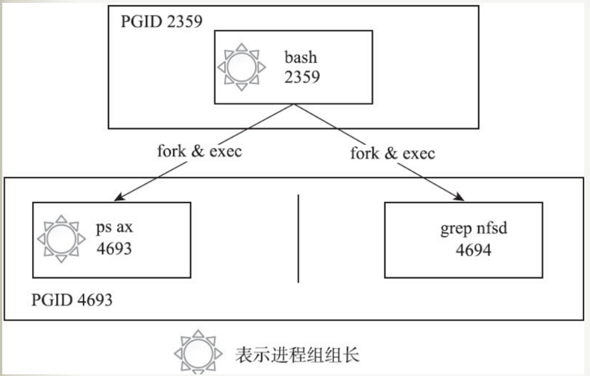
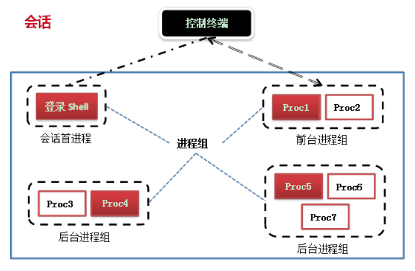

# 守护进程
*守护进程即在后台运行的、系统启动是就存在的、不予任何终端关联的，用于处理一些系统级别任务的特殊进程*

## 进程 进程组 会话
* 进程: 即系统进行资源分配的最小单位
* 进程组：包含有若干个进程的分组，每个进程必定在某个进程组中，每个进程组有一个进程组组长，一般是该进程组的第一个进程

* 会话：由若干个进程组构成，每个会话由若干个进程组构成，其中进程组可以分为前台进程组和后台进程组
  - 前台进程组可以和终端进行I/O通信，即对终端进行读写操作
  - 后台进程组仅向终端进行写操作，**该会话的第一个进程(一般为登录shell)称之为会话首进程，该进程可以控制终端**

## 守护进程创建流程

创建一个守护进程的流程一般是
1. `fork`创建子进程son1,此时son1和父进程在同一个会话session1内
2. 在子进程内调用`setsid`,由son1组成了一个新的会话session2内,需要注意的是此时son1是session2的会话首进程,可以创建新的控制终端,而守护进程要与终端尽可能剥离,防止因为终端关闭而导致收到SIGHUP信号而退出
3. 在son1中继续调用`fork`创建子进程son2且son1退出,此时son2并非会话首进程不存在创建新的控制终端的可能,做到了与控制终端剥离

*举个栗子，参考./src/daemon.c文件*

## SIGHUP信号
*SIGHUP信号在用户终端连接(正常或非正常)结束时发出，通常是在终端的控制进程结束时，通知会话内的各个作业控制终端已经结束，系统会终止收到该信号的进程，除非该进程使用`signal`来对该信号进行处理*

该信号在以下三种情况会被发送给对应的进程
1. 关闭终端时，发送给对应session的首进程
2. session首进程退出时，该信号被发送到该session的前台进程组中的每一个进程
3. 若父进程退出导致进程组成为孤儿进程组，且该进程中有进程处于停止状态，该信号会被发送到进程组中的每一个进程

## 孤儿进程与僵尸进程
* 孤儿进程指的是父进程退出,而它的一个或多个子进程还在运行,该进程将会成为孤儿进程. 孤儿进程将由init进程所收养,并由init进程对它们完成状态收集工作
* 僵尸进程指的是当子进程退出时,父进程并未调用`wait`或者`waitpid`获取子进程的状态信息导致子进程的pcb仍然保留在系统中

*孤儿进程和僵尸进程最大的区别在于 子进程退出时其父进程还在不在，如果不在的话说明其是个孤儿由`init`进程来做善后;如果在但是没有调用`wait`或者`waitpid`来善后的话,就僵死了*

